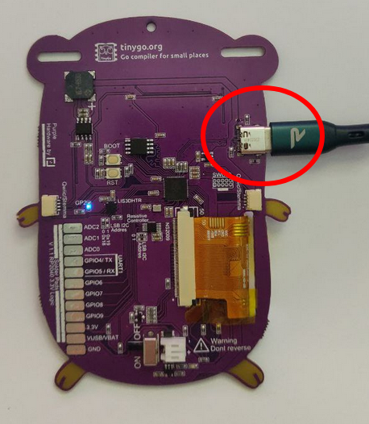
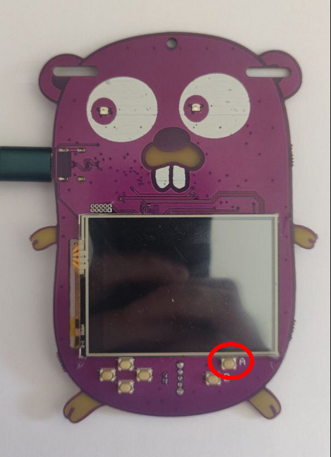
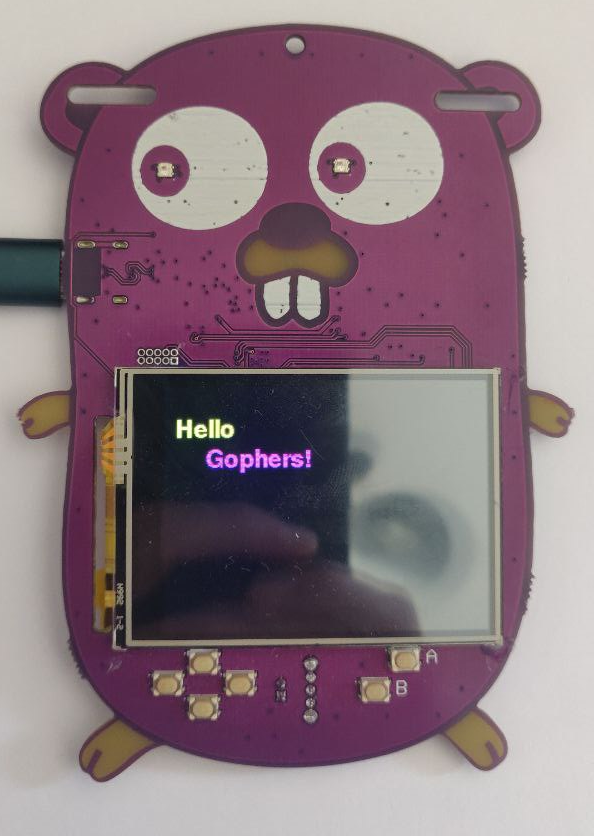
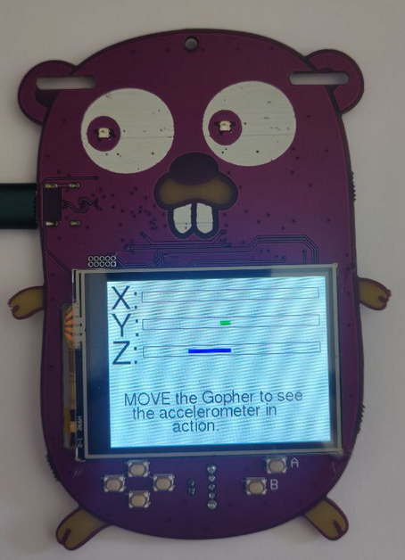
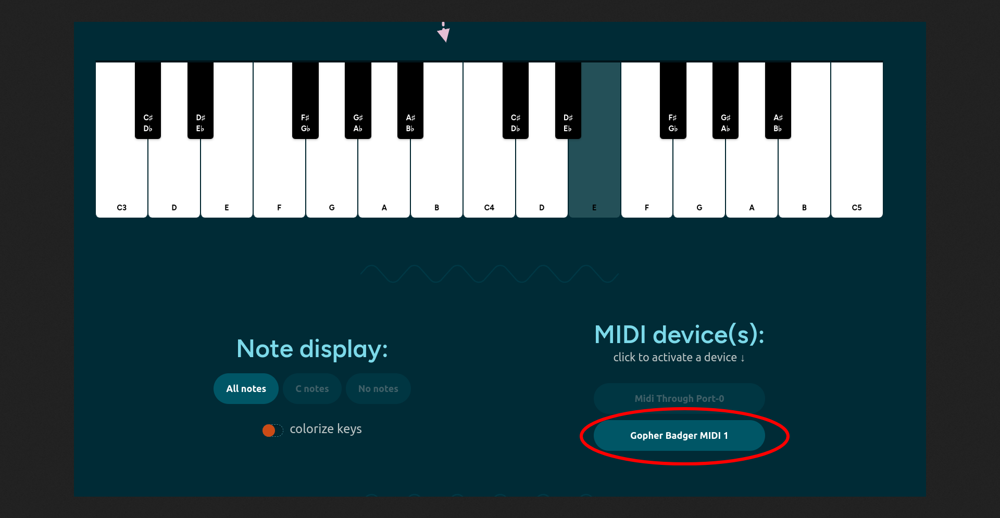

# Gopher Badge Tutorial

## What you need

    - Gopher Badge aka the cutest badge out there
    - Personal computer with Go 1.20 and TinyGo 0.27 installed, and a serial port.

## Installation

### Go

If somehow you have not installed Go on your computer already, you can download it here:

https://go.dev/dl/

Now you are ready to install TinyGo.

### TinyGo

Follow the instructions here for your operating system:

https://tinygo.org/getting-started/

## Connecting the Gopher badge to your computer


Plug the Gopher badge into your computer using a USB cable. There may be one provided in your starter kit.



## Running the code

The TinyGo programs will run directly on the Gopher badge's microcontroller. The procedure is basically:

- Edit your TinyGo program.
- Compile and flash it to your Gopher badge.
- The program executes from the Gopher badge. You can disconnect the Gopher badge from your computer (plug it into a battery, if it isn't already), the program executes directly on the microcontroller.

Let's get started!

## Code

### step0.go - Built-in LED

This tests that you can compile and flash your Gopher badge with TinyGo code, by blinking the built-in LED (it's on the back).


```
tinygo flash -target gopher-badge ./step0
```

Once the Gopher badge is flashed correctly, the built-in LED labeled "D13" (on the back) should start to turn on and off once per second. Now everything is setup correctly and you are ready to continue.


### step1.go - Built-in LED, A Button

Run the code.

```
tinygo flash -target gopher-badge ./step1
```

When you press the A button, the built-in LED on the back should turn on.



*Challenge:* 
See if you can modify [./step1/main.go](step1/main.go) so that the LED turns on if
the _B_ button is pressed instead of the _A_ button.

### step2.go - Neopixels

Run the code.

```
tinygo flash -target gopher-badge ./step2
```


The 2 neopixels should light up green and red alternatively.


### step3.go - Neopixels, Buttons

Run the code.

```
tinygo flash -target gopher-badge ./step3
```

The 2 neopixels should light up in different colors depending on which button you press.

What happens if you press more than one button at a time?

try out `./step3b`, what does it do?

After deploying it should look like this:


### step4.go - Display

Run the code.

```
tinygo flash -target gopher-badge ./step4/main.go
```

The message "Hello Gophers!" should appear on the display.




### step5.go - Display, Buttons

Run the code.

```
tinygo flash -target gopher-badge ./step5/main.go
```


The display will show some blue circle that represent that buttons on the board.
When a button is pressed a ring will be shown around its corresponding circle.

### step6.go - Display, Accelerometer


Run the code.

```
tinygo flash -target gopher-badge ./step6
```



The display will show a bar for each X,Y,Z axis. Move the Gopher badge to see it in action.

### step7.go - Buzzer, Buttons

Run the code.

```
tinygo flash -target gopher-badge ./step7/main.go
```

Press the buttons and create your melody.


### step8.go - Buttons, USB midi interface

Run the code.

```
tinygo flash -target gopher-badge ./step8/main.go
```

Go to any online midi player with USB capabilities, like [Muted.io/piano](https://muted.io/piano/). Make sure the Gopher Badge MIDI is enabled (this website works better in Chrome, other browsers might not detect the
Gopher Badge as a MIDI device).
Press the buttons and create your melody.





### step9.go - Buttons, Accelerometer, USB HID interface

Run the code.

```
tinygo flash -target gopher-badge ./step9/main.go
```

Your Gopher Badge, connected to a computer, will act as a mouse now. Pressing the A button will perform a reft click, B button a right click, and inclining the badge will move the mouse's pointer thanks to the 
badge's built-in accelerometer.

Good job in completing the basic tutorials. Now can check out the more complicated
tutorials

### Snake Game

[Play the famous Snake game on the Gopher badge.](../snake/README.md)

### My Name Is

This example display you name. Use this to make a simple name badge
[My Name is](../mynameis/README.md)

Configure your name and use the awesome TinyGo-powered badge!

Note:

Find the different type of fonts you can use [here](https://github.com/tinygo-org/tinyfont)


## Next steps & ideas
                              
For example:

- Add new effects and animations to the badge code, like Multipass from _The fifth element_ movie.
- Use the 3-axis accelerometer to check if the wearer has tripped and fall down and send an SOS alarm (SOS in morse code is ... --- ...  , use the buzzer and RGB LEDs)
- Create your own Rubber Duck attack (examples/rubber-duck).


# Not powering up with battery connected
If your battery is connected and switching your badge to ON doesn't power it up, **disconnect your battery, switch to ON and connect your battery again**. If it doesn't power up, then check the battery charge.